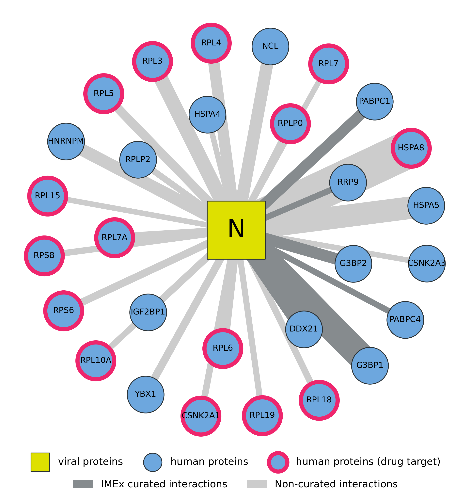

# Computational analysis of SARS-CoV-2 virus-host protein-protein interactions

This is a companion repository for the following manuscript:

* **Open science resources for the mass spectrometry-based analysis of SARS-CoV-2** (TODO: citation when available)

The repository consists of a Jupyter notebook with a tutorial of the computational steps needed to analyze affinity purification mass spectrometry (AP-MS) data to detect high-confidence protein-protein interactions (PPIs).

Starting from raw AP-MS data generated by [Gordon et al. (2020)](https://doi.org/10.1038/s41586-020-2286-9) to study the SARS-CoV-2 virus-host interactome, the notebook contains an end-to-end computational PPI analysis with detailed step-by-step instructions, including spectrum identification, PPI filtering and network visualization, and identifying potential targets for drug repurposing.

## Contact

For more information, please send an email to <wbittremieux@health.ucsd.edu>.
